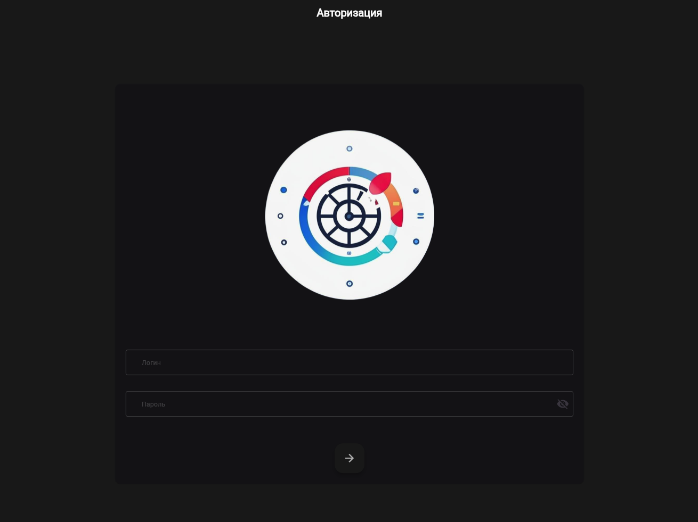
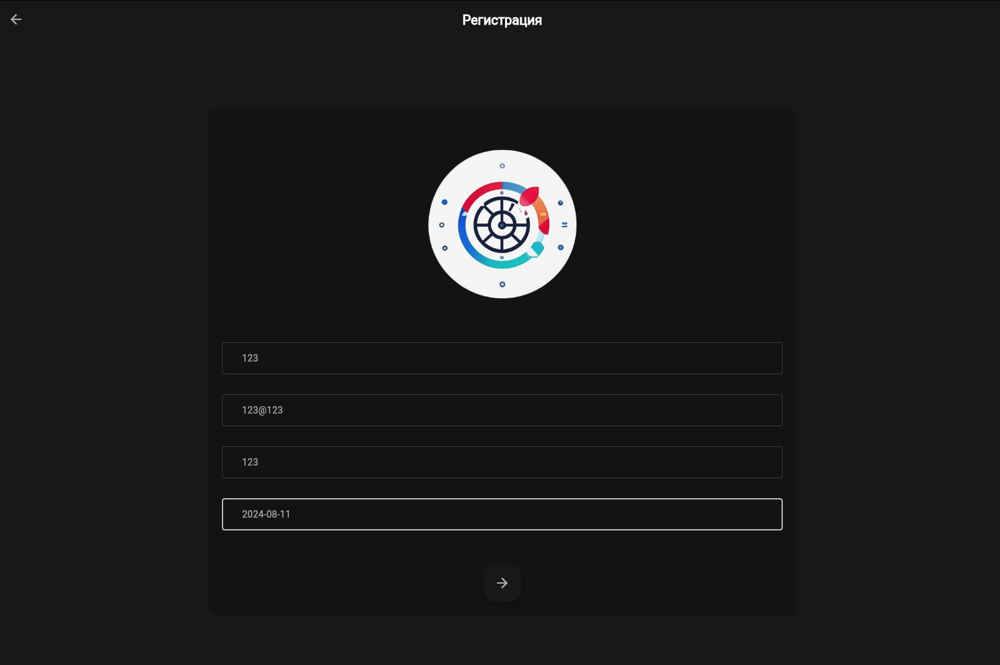
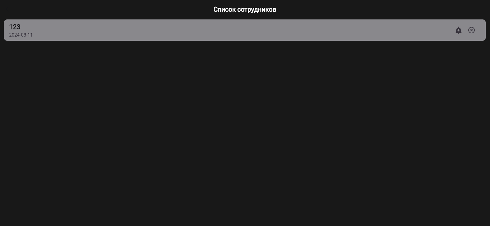

# Приложение для оповещения о дне рождении сотрудников
Для запуска docker compose up(при первом запуске возможна проблема с подключением к бд, в таком случае, стоит просто перезагрузить docker compose)
## Описание приложения

### Backend
Backend хранится в папке Gaz, проект использует чистую архитектуру, в нем реализовано 3 слоя приложения - Работа с запросами, Сервисный слой, Слой репозитория.
Для слоя репозитория и handler слоя написаны Unit тесты. Была использована библиотека cron, которая запускает в отдельной горутине процесс, который отвечает за отправку
сообщений на почты пользователей, подписанных на людей, у которых завтра день рождения. Функция вызывается в 20:30 каждого дня. API документироваано сваггером по маршруту :8080/swagger
#### Handler
Handler слой использует фреймворк fiber для работы с поступающими запросами, есть protected маршруты,
они защищены jwt токеном.
#### Service
Сервисный слой в этом проекте испоьзуется для реализации логики создания и проверки jwt токенов, а так же хэширования паролей
#### Repository
Слой репозитория нужен для работы с базой данных(Postgresql)

### Frontend
Для реализация frontend части был выбран Flutter, в нем была забилжена web версия приложения и закинута в docker контейнер
## Скрины работы программы 

